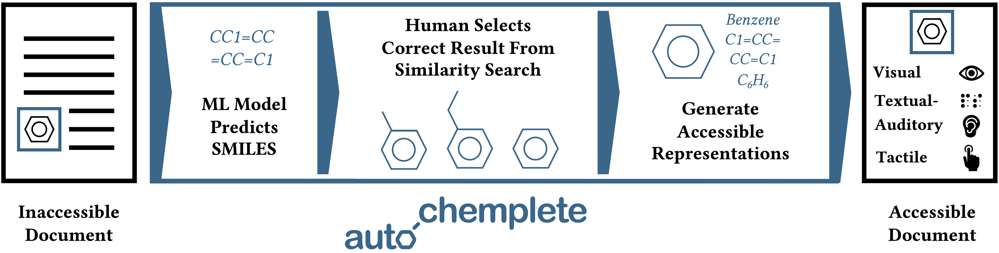

# AutoChemplete - Making Chemical Structural Formulas Accessible

Despite their interests, blind and low vision students avoid STEM subjects. Research attributes this to a lack of accessible material. Annotating STEM content such as chemical structural formulas requires expert domain knowledge, is time consuming, and frustrating. We conduct interviews with blind and low vision chemists and accessibility professionals to derive requirements for tool support. On this basis, we develop AutoChemplete, an interactive labeling tool for chemical structural formulas. It ingests images and uses machine learning to predict the molecule. With a similarity search in the solution space, we enable even novices to simply pick from options. From this we are able to generate accessible representations. We conduct fifteen think-aloud sessions with participants of varying domain expertise and find support of different annotation styles simultaneously. Not only does AutoChemplete strike a balance in skill-support, participants even find it entertaining.

*by Merlin Knaeble, Gabriel Sailer, Zihan Chen, Thorsten Schwarz, Kailun Yang, Mario Nadj, Rainer Stiefelhagen, & Alexander Maedche*

## Structure

Please find further information on the user interface in the `ui` folder, and details on our model to detect structural formulas under `ml`.

## Publications

### Please Cite As

Knaeble, M., Sailer, G., Chen, Z., Schwarz, T., Yang, K., Nadj, M., Stiefelhagen, R., & Maedche, A. (2023). AutoChemplete—Making chemical structural formulas accessible. 20th International Web for All Conference, 104–115. https://doi.org/10.1145/3587281.3587293

### Further Works

Knaeble, M., Sailer, G., Chen, Z., Schwarz, T., Yang, K., Nadj, M., Stiefelhagen, R., & Maedche, A. (2023). Autochemplete—Making chemical structural formulas accessible. 20th International Web for All Conference (Accessibility Challenge, Extended Abstract), 173–174. https://doi.org/10.1145/3587281.3588145

Knaeble, M., Chen, Z., Schwarz, T., Sailer, G., Yang, K., Stiefelhagen, R., & Maedche, A. (2022). Accessible chemical structural formulas through interactive document labeling. In K. Miesenberger, G. Kouroupetroglou, K. Mavrou, R. Manduchi, M. Covarrubias Rodriguez, & P. Penáz (Eds.), Computers Helping People with Special Needs (Vol. 13341, pp. 38–46). Springer International Publishing. https://doi.org/10.1007/978-3-031-08648-9_6
